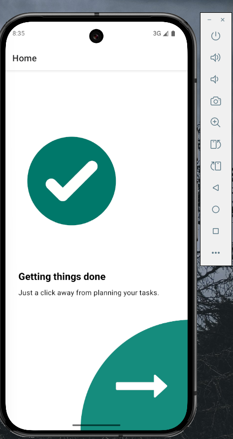
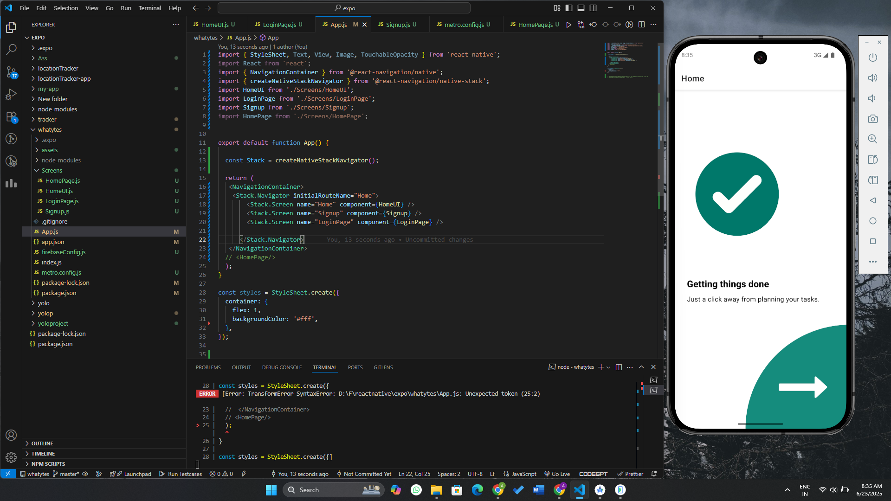
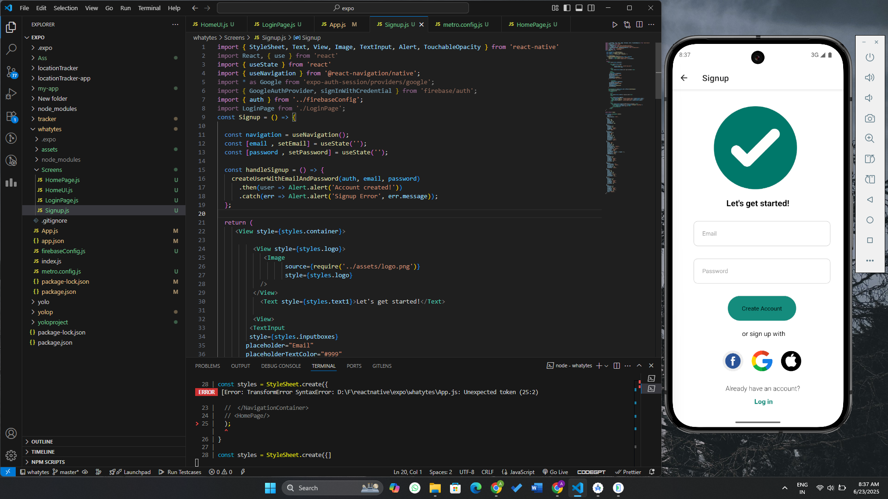
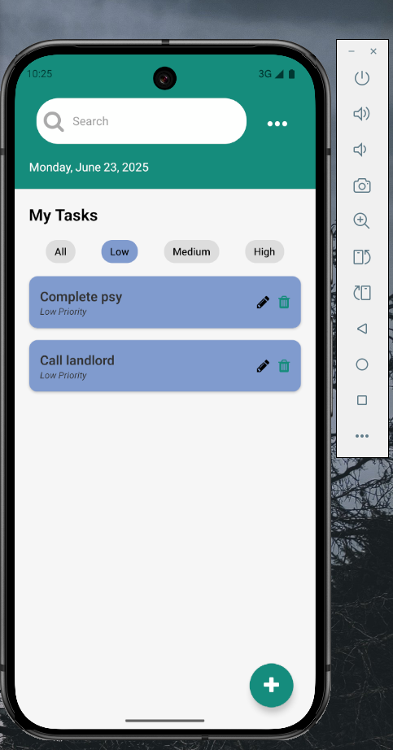
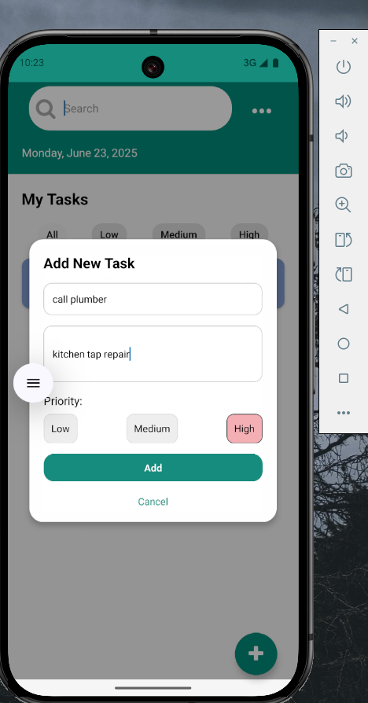

✅ TaskEase — Your Daily Task Manager App
TaskEase is a beautifully designed task management mobile app built with React Native (Expo). Whether you're scheduling tasks or just planning your day, TaskEase helps you organize, prioritize, and manage your todos effortlessly.

 
✨ Features
📆 Daily Overview: Displays the current date and task list in a clean layout.

📝 Add New Tasks: Easily add a task with a title, description, and select priority.

🚦 Priority Filters: View tasks by All, Low, Medium, or High priority.

🧾 View & Edit Tasks: Tap any task to view its details or edit its content.

❌ Delete Tasks: Remove unwanted tasks with a single tap.

🔐 Authentication: Signup and login using email or social providers (Google, Facebook, Apple).

🎨 Modern UI: Polished UI with modal sheets, shadowed cards, and intuitive buttons.

 

Screenshots
|  |  |  |  |  | 
