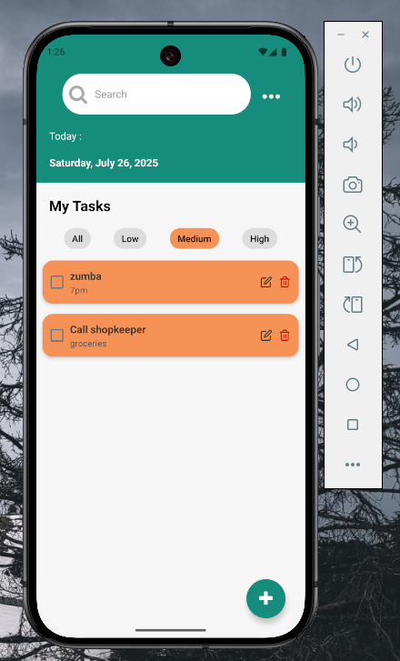

# Taskease 📋  
**By Adrika Dwivedi**

## 📱 Project Overview

"My Tasks" is a simple React Native to-do list app built using **Expo**. It allows users to add, complete, and delete tasks, while also scheduling **local notifications** as reminders for each task. The project demonstrates core mobile development skills such as state management, list rendering, basic UI interactions, and Expo Notifications.

---

## ⚙️ Technologies Used

- **React Native**
- **Expo Go**
- **JavaScript (ES6+)**
- **Expo Notifications**
- **React Hooks (useState, useEffect)**

---

## 🚀 Features

### ✅ Core Functionality
- **Task Input**: Add new tasks via a text input and button.
- **Task List**: Scrollable list of tasks with visual distinction between completed and incomplete tasks.
- **Task Completion**: Toggle task status with strikethrough styling for completed tasks.
- **Task Deletion**: Remove tasks easily using a delete button.
  
### 🔔 Local Notifications
- For each new task, a local notification is scheduled to trigger **1 minute** after creation.
- Notifications display:  
  `"title: "📣 Reminder! Complete your pending tasks""`
---

## Known limitationa
Due to recent changes, local notifications using expo-notifications are not supported on Android emulators as the feature has been deprecated or restricted.
Please test the notification functionality on a physical device only using the Expo Go app.

This applies especially to features like:
Scheduling task reminder notifications
Cancelling notifications on task completion
<br>
---
## 📦 Getting Started

### Prerequisites
- Node.js & npm installed
- Expo CLI installed (`npm install -g expo-cli`)
- Expo Go app installed on your Android/iOS device

### Setup Instructions

1. **Clone the Repository**:
   ```bash
   git clone https://github.com/adrikaDwivedi/taskease.git
   cd taskease
   
Install Dependencies:


bash <br>
npm install

Start the App: <br>
bash <br>
npx expo start <br>

Run on Device:
Scan the QR code from the terminal or browser using the Expo Go app on your phone.

Screenshots
<p align="center">
    
    
    
    <br>
  
   
  

  <br>
  
   
  

  
</p>
